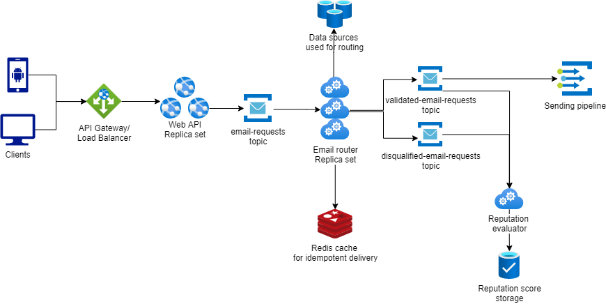

# Email Requests Router

## Requirements
- Non-functional:
    - Valid email requests can not be lost during processing. This means that the system should be fault tolerant and highly available.
    - Clients want their emails to be delivered as soon as possible, but slight delay is acceptable. Soft real-time.
    - System should be able to react to increasing/decreasing load and scale appropriately.
- Functional (for routing component)
    - Should pick submitted requests and categorize them according to business rules.
    - Filter requests based on "From" address.
    - Routing system should be open for extension like adding new filters and categorization rules.
    - Content sentiment evaluation.
    - Messages and senders scoring/rating system.

## Proposed solution
  
If image is not displayed properly please open it in separate window. [HighLevelArchitecture.png](https://github.com/Lildan/email-requests-router/blob/master/documentation/resources/HighLevelArchitecture.png)

1. Load Balancer that is responsible for requests rate limiting and forwarding requests to Web API.
2. Web API is stateless, horizontally scalable application behind load balancer that exposes REST endpoints to the clients. Responsible for authentication/authorization, basic request model validation, generation of unique ids for each email request. Valid requests are enriched with additional information (like client's data) and published to Kafka topic `email-requests` for further processing. Batch email requests are split and puublished to Kafka as individual messages. This approach makes possible fast respones to clients before their submission processing is completed. Clients receive in response unique Ids for each of their email requests. These ids should later be used to get status of processing and delivery.  
3. Kafka was selected as a message broker for this exercise. This is a messaging technology that I'm the most experienced with which will help me to implement the solution fast and within given time constraints. Kafka might be replaced with alternative solutions. There is explanation why RabbitMQ might be a better solution down in the improvements section.
4. Processed and categorised message requests are published to the respective topics (`validated-email-requests` or `disqualified-email-requests`) for further processing by sending pipeline and/or other services.
5. Redis cache is used to enable idempotent publishing of processed messages.
6. Downstream email-sending components are expected to consume processed messages from `validated-email-requests` and send emails to recipients.
7. Sender/message rating evaluation component consumes from both validated and disqualified topics and persists scores in DB.
8. Email requests should be also persisted to be able to provide to clients their requests history and other data. Specific DB type is up to discussion.

I would select Kubernetes as a solution for PROD deployment of this system. It is a reliable container orchestrations solution that enables  zero-downtime deployments and efficient scaling according to load.

## Implementation details of Email Requests Router
Using basic [anemic domain model](src/EmailRequestsRouter/Domain) for this exercise that was mostly reused from [Postmark official API documentation](https://postmarkapp.com/developer/api/email-api#send-a-single-email) and [Postmark .Net Client](https://github.com/wildbit/postmark-dotnet/tree/master/src/Postmark/Model).  

To consume from Kafka using basic consumer loop implementation from [Confluent examples](https://github.com/confluentinc/confluent-kafka-dotnet/tree/master/examples/Web).

Docker-compose.yml uses Kafka distribution from Landoop that is handy for development, debugging and testing purposes.  

Repository contains files for remote debugging in container for both Visual Studio and VS Code (files in in .vscode and docker-compose.dcproj).

Email Requests Router impements several primitive steps
1. Subscribe to appropriate topic.
2. Consume available messages in a loop.  
3. Deserialize message.
4. Push message through the processing pipeline.
5. Push message enriched with processing results downstream into respective topic based on whether all processing steps succeded or not.

Processing pipeline might be extended by implementing additional processing steps according to predefined [interface](src/EmailRequestsRouter/IProcessingStep).
Configuration and all dependencies (Kafka) are externalized as environment variables and defined in [docker-compose](docker-compose.yml) file.

## Run the application demo 
You will need Docker desktop installed on your machine. At least 16GB of RAM is recommended.  

Start the application
```
docker-compose up -d
```
Create input topic in Kafka
```
docker-compose exec kafka-cluster bash -c "kafka-topics --zookeeper localhost:2181 --create --topic email-requests --partitions 1 --replication-factor 1"
```
Publish several email request messages to input topic
```
docker-compose exec kafka-cluster bash -c 'echo { \"Id\": \"df5c25ed-73fc-43c5-b8e6-5d729eb35f03\", \"Client\": { \"Id\": \"85723357-1e18-44d9-9367-7110b3722c17\" }, \"EmailPayload\": { \"From\": \"sender@example.com\", \"To\": \"receiver@example.com,receiver2@example.com\", \"Cc\": \"copied@example.com\", \"Bcc\": \"blind-copied@example.com\", \"Subject\": \"Test\", \"Tag\": \"Invitation\", \"HtmlBody\": null, \"TextBody\": \"Hello\", \"ReplyTo\": \"reply@example.com\", \"Headers\": [ { \"Name\": \"CUSTOM-HEADER\", \"Value\": \"value\" } ], \"TrackOpens\": true, \"TrackLinks\": \"None\", \"Attachments\": [ { \"Name\": \"readme.txt\", \"Content\": \"dGVzdCBjb250ZW50\", \"ContentType\": \"text\/plain\" } ], \"Metadata\": { \"color\": \"blue\", \"client-id\": \"12345\" }, \"MessageStream\": \"outbound\" }, \"SubmittedAt\": \"2021-09-09T17:50:45.346Z\" } | kafka-console-producer --broker-list localhost:9092 --topic email-requests'
```

To see results  
Consume from validated messages topic
```
docker-compose exec kafka-cluster bash -c "kafka-console-consumer --bootstrap-server localhost:9092 --from-beginning --topic validated-email-requests | jq"
```
Consume from disqualified messages topic
```
docker-compose exec kafka-cluster bash -c "kafka-console-consumer --bootstrap-server localhost:9092 --from-beginning --topic disqualified-email-requests | jq"
```
Or you can use Landoop UI to inspect topics content http://localhost:3030/kafka-topics-ui/ . Filter topics for `email` keyword.

## Further improvements

- Enable message compression for kafka clients. As email message requests might contain binary attachments compression might significantly boost throughput.
- Take advantage of Kafka Schema Registry. It will bring such benefits:
    - Externalize shared data schemas in single place for easy usage among different components.
    - Benefit from better message compression (if we chose to use avro/protobuf).
    - Ability to define and enforce data schema evolution policies (backward/forward/full compatibility).
- Logging improvements: 
    - Amount of logging in this basic exercise is very basic and will not provide the amount of details and information that would be required in production ready applications
    - Implement structural logging. Enrich logs with some kind of correlation-id. EmailRequestMessage.Id might be a suitable identifier for this purpose as it will be propagated down the sending pipeline.
- Current implementation doesn't create lifetime scopes for each processed message. This has to be implemented as real processing steps might need to access external dependencies and data sources. Proper implementation will require objects with scoped/transient lifetime for each message.
- Improve processing pipeline with ability to control the order of processing steps, enable parallel execution of independent steps, make `ProcessingResult` more generic and flexible to be able to include more details.
- Implement idempotent delivery of messages down to sending pipeline. Kafka has internal mechanisms that handle retries during connectivity issues. But it doesn't guarantee idempotency in case consumer from `email-requests` fails to commit updated offset. As a deduplication mechanism I would use shared cache like `Redis` to store Ids of recently published email requests. Email requests router instances would check cache before sending messages for further processing in sending pipeline.
- Implement parallel processing of messages within single application instance with the help of batch fetching from broker. Batch of messages can be added to `BlockingCollection` from which multiple processing threads take items and process in parallel.
- Why Rabbit might be a better option then Kafka?  
  We do not really take advantage of any unique Kafka's feature but at the same time we are limited by Kafka's architecture that is focused on ordered messages processing. Consumers are limited to linear increase of offset which makes hard to implement things like retries.
    - Rabbit has out of the box mechanisms for retry and dead messages queues.
    - Rabbit has much more flexible acknowledgement mechanisms.
    - Rabbit supports much bigger maximal size of messages (Up to gigabytes). Kafka's limit is 20 MB. It is  within Postmarks limit for single email, but might be a problem for future.
    - Rabbit supports message priority. It might be useful in a case when business wants to prioritize clients with high rating.  
 
  These thoughts bring me to the conclusion that RabbitMQ will be better option compared to Kafka.